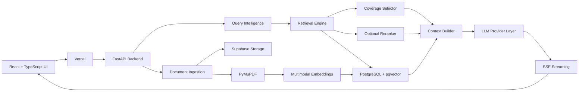
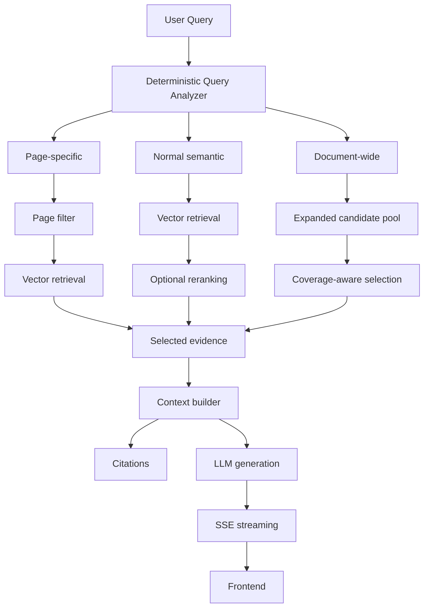

<div align="center">

# ⬡ ASK NOVA

### Multimodal AI Knowledge Workspace built around retrieval, evidence, and evaluation.

[](https://www.python.org/)
[](https://fastapi.tiangolo.com/)
[](https://react.dev/)
[](https://www.typescriptlang.org/)
[](https://www.postgresql.org/)
[](https://github.com/pgvector/pgvector)
[](https://docs.docker.com/compose/)

</div>

> **The hard part of RAG isn't generating an answer. It's retrieving the right evidence for the question being asked.**

ASK NOVA is an end-to-end multimodal knowledge workspace I built to investigate that problem.

The system started with conventional dense retrieval. A focused 15-question evaluation showed a strong **93.3% overall Recall@5** baseline, but also exposed a specific weakness: **whole-document questions achieved only 50% Recall@5**, even though local semantic, page-specific, multi-chunk, and visual retrieval performed strongly.

That led to a retrieval change rather than simply a model change:

**query-aware routing + coverage-aware evidence selection.**

On the same focused benchmark:

## **Whole-document Recall@5: 50% → 100%**

I then tested a multimodal reranker separately. Recall stayed unchanged while MRR decreased from **0.904 → 0.894**, so it wasn't enabled by default.

The retrieval system was then productized into a persistent AI workspace with document-scoped conversations, document search, chat search, multimodal grounding, citations, streaming, provider failover, and public deployment.

---

## Try ASK NOVA

**[Live Demo](INSERT LIVE URL)** · **[Video Demo](INSERT VIDEO URL)** · **[GitHub](INSERT GITHUB URL)**

> [!NOTE]
> **Deployment note:** The public application runs on cost-conscious/free-tier infrastructure, so the live deployment can occasionally be slower or experience cold starts. The video demo provides a deterministic way to see the complete product without depending on deployment latency.

---

## Table of Contents

- [The engineering result](#the-engineering-result)
- [What problem was I actually solving?](#what-problem-was-i-actually-solving)
- [From Vector Search to Coverage-Aware Retrieval](#from-vector-search-to-coverage-aware-retrieval)
- [System at a glance](#system-at-a-glance)
- [A persistent AI knowledge workspace](#a-persistent-ai-knowledge-workspace)
- [Document search ≠ Chat search ≠ RAG retrieval](#document-search--chat-search--rag-retrieval)
- [Retrieval scopes](#retrieval-scopes)
- [Multimodal document understanding](#multimodal-document-understanding)
- [Lightweight query intelligence](#lightweight-query-intelligence)
- [I also tested reranking](#i-also-tested-reranking)
- [Architecture](#architecture)
- [Retrieval flow](#retrieval-flow)
- [Document ingestion](#document-ingestion)
- [Provider resilience](#provider-resilience)
- [Streaming with SSE](#streaming-with-sse)
- [Product surface](#product-surface)
- [Production engineering](#production-engineering)
- [Deployment](#deployment)
- [Technology stack](#technology-stack)
- [What the system demonstrates](#what-the-system-demonstrates)
- [Engineering tradeoffs](#engineering-tradeoffs)
- [Evaluation methodology](#evaluation-methodology)
- [Potential applications](#potential-applications)
- [Repository structure](#repository-structure)
- [Current status](#current-status)
- [Limitations](#limitations)
- [What I'd build next](#what-i'd-build-next)
- [The takeaway](#the-takeaway)

---

# The engineering result

| Metric                      | Dense baseline | Coverage-aware |
| --------------------------- | -------------: | -------------: |
| Overall Recall@5            |          93.3% |      **100%*** |
| Overall Recall@10           |          93.3% |      **100%*** |
| Overall Recall@20           |           100% |      **100%*** |
| MRR                         |          0.904 |    **~0.922*** |
| **Whole-document Recall@5** |        **50%** |      **100%*** |

* Results from the focused evaluation artifact. The benchmark contains 15 curated questions, so these results are evidence from a targeted benchmark, not a universal production retrieval guarantee.

### The important result

**Whole-document Recall@5 improved from 50% to 100%.**

The interesting part wasn't simply the number.

It was finding out **why the baseline failed**.

---

# What problem was I actually solving?

A conventional RAG pipeline looks roughly like:

```text
User question
     ↓
Embedding
     ↓
Vector search
     ↓
Top-K chunks
     ↓
LLM
     ↓
Answer
```

That works well for many questions.

But consider:

> "Give me a broad overview of all the architecture patterns discussed in this guide."

The required evidence might be distributed across:

```text
Page 12
Page 16
Page 20
Page 22
```

A similarity search ranks chunks independently.

If several highly similar chunks happen to come from the same local region, they can dominate the top-K results even when the question requires evidence from several distant parts of the document.

That exposed the central problem:

> **Semantic relevance and evidence coverage are not always the same retrieval objective.**

This wasn't primarily an embedding-model problem.

It was an **evidence-distribution problem**.

---

# From Vector Search to Coverage-Aware Retrieval

I deliberately started with a conventional dense retrieval baseline instead of designing a complex retrieval system upfront.

The benchmark contained **15 human-curated questions** across seven categories:

| Category            | What it tests                                   |
| ------------------- | ----------------------------------------------- |
| `basic_semantic`    | Direct semantic retrieval                       |
| `section_retrieval` | Evidence from a relevant section                |
| `page_specific`     | Questions tied to specific pages                |
| `multi_chunk`       | Answers requiring multiple chunks               |
| `visual`            | Retrieval involving visual document content     |
| `whole_document`    | Evidence distributed across a document          |
| `synthesis`         | Combining multiple retrieved pieces of evidence |

### Baseline results

| Category           | Recall@5 | Recall@10 | Recall@20 |       MRR |
| ------------------ | -------: | --------: | --------: | --------: |
| Basic semantic     |     100% |      100% |      100% |     1.000 |
| Section retrieval  |     100% |      100% |      100% |     1.000 |
| Page-specific      |     100% |      100% |      100% |     1.000 |
| Multi-chunk        |     100% |      100% |      100% |     1.000 |
| Visual             |     100% |      100% |      100% |     1.000 |
| **Whole-document** |  **50%** |   **50%** |  **100%** | **0.278** |
| Synthesis          |     100% |      100% |      100% |     1.000 |

The baseline wasn't broadly broken.

That made the failure more interesting.

Most retrieval modes were already strong. The weakness was concentrated in questions where **evidence had to be distributed across a document**.

---

## The change

Instead of replacing the embedding model, ASK NOVA changes retrieval behavior based on query intent.

```text
                         User Query
                              │
                              ▼
                    ┌──────────────────┐
                    │ Query Intelligence│
                    └────────┬─────────┘
                             │
              ┌──────────────┼──────────────┐
              │              │              │
              ▼              ▼              ▼
        Page-specific    Normal semantic   Document-wide
              │              │              │
              ▼              ▼              ▼
        Page filter      Vector search   Expanded candidates
                             │              │
                             ▼              ▼
                       Optional rerank   Coverage selector
                             │              │
                             └──────┬───────┘
                                    ▼
                             Selected evidence
                                    │
                                    ▼
                              Context builder
                                    │
                                    ▼
                                   LLM
                                    │
                                    ▼
                                   SSE
```

For document-wide queries, the system:

1. Detects broad/document-wide intent.
2. Expands the candidate pool.
3. Preserves semantic relevance.
4. Encourages page diversity.
5. Penalizes excessive same-page concentration.
6. Selects evidence using relevance and coverage.

Conceptually:

```python
if query.is_document_wide:
    candidates = vector_search(limit=100)
    evidence = coverage_selector(candidates, top_k=5)
else:
    candidates = vector_search(limit=30)
    evidence = rerank_or_similarity(candidates)
```

The important design decision is:

> **Different questions can require different retrieval objectives.**

A page-specific question needs precision.

A document-wide question needs broader evidence coverage.

---

# System at a glance

```text
                         ASK NOVA
                            │
          ┌─────────────────┴─────────────────┐
          │                                   │
     Knowledge Layer                    Conversation Layer
          │                                   │
   Documents + Search                  Chats + Chat Search
          │                                   │
          └─────────────────┬─────────────────┘
                            │
                     Query Intelligence
                            │
                 ┌──────────┴──────────┐
                 │                     │
           Local retrieval       Broad retrieval
                 │                     │
             pgvector          Coverage selection
                 │                     │
                 └──────────┬──────────┘
                            │
                    Evidence + citations
                            │
                      LLM generation
                            │
                         SSE → UI
```

This is the core product architecture:

**knowledge context + conversation context → retrieval scope → evidence → grounded generation**

---

# A persistent AI knowledge workspace

ASK NOVA isn't designed around:

```text
Upload PDF → Ask Question → Get Answer
```

It's designed around persistent investigation.

```text
Discover documents
       ↓
Organize knowledge
       ↓
Create a conversation
       ↓
Select relevant documents
       ↓
Investigate
       ↓
Retrieve grounded evidence
       ↓
Continue the conversation
       ↓
Return later
```

## Knowledge context

* Document library
* Document search/filtering
* Document selection
* Multi-document selection
* Document preview
* Document download
* Document deletion
* Reindexing
* Processing status
* Duplicate detection

## Conversation context

* Persistent conversations
* Conversation history
* Chat search
* Conversation-specific document associations
* Document-scoped retrieval
* Grounded citations

For example:

```text
Conversation A → Document X

Conversation B → Document X + Document Y

Conversation C → Document Z
```

These aren't simply different prompts.

They define different **retrieval contexts**.

That creates an important boundary for real knowledge workflows: a question should not accidentally retrieve evidence from unrelated documents simply because those documents happen to exist in the same knowledge base.

---

# Document search ≠ Chat search ≠ RAG retrieval

ASK NOVA deliberately separates three different search problems:

| Capability          | Purpose                                |
| ------------------- | -------------------------------------- |
| **Document search** | Find knowledge sources                 |
| **Chat search**     | Find previous investigations           |
| **RAG retrieval**   | Find evidence for the current question |

A user might have conversations such as:

```text
AWS Architecture Research
Agentic AI Notes
Q3 System Design
RAG Evaluation
```

and later search their conversation history to return to the relevant investigation.

> **AI work should be persistent, not disposable.**

The implementation details of chat search are intentionally not overstated here; the important product distinction is that **chat search is a navigation feature for previous investigations, not automatically another semantic retrieval layer**.

---

# Retrieval scopes

ASK NOVA supports several explicit retrieval scopes:

| Scope               | Purpose                                    |
| ------------------- | ------------------------------------------ |
| **Global**          | Search across the available knowledge base |
| **Document-scoped** | Restrict evidence to selected documents    |
| **Page-specific**   | Target an explicit page                    |
| **Document-wide**   | Optimize for distributed evidence coverage |

This matters when users are simultaneously working on unrelated reports, specifications, policies, technical documents, or research.

---

# Multimodal document understanding

Enterprise documents aren't just text.

Important evidence can live inside:

* Architecture diagrams
* Flowcharts
* Technical figures
* Visual tables
* Screenshots
* System blueprints

ASK NOVA therefore treats visual content as part of the retrieval problem.

### Ingestion

```text
PDF
 │
 ├── Text extraction
 ├── Embedded image detection
 └── Vector drawing / visual inspection
          │
          ▼
     Page rendering
          │
          ▼
 Multimodal representation
          │
          ▼
  2048-dimensional embedding
          │
          ▼
 PostgreSQL + pgvector
```

The multimodal embedding path uses:

`nvidia/llama-nemotron-embed-vl-1b-v2:free`

with **2048-dimensional embeddings**.

When visual evidence is selected, the corresponding page can be reconstructed as an image and passed into the vision-capable generation context.

That allows questions such as:

> "Explain the architecture shown in this diagram."

to be grounded in the actual visual page rather than depending entirely on extracted text.

---

# Lightweight query intelligence

ASK NOVA uses deterministic query analysis before retrieval.

Two particularly useful signals are:

### Explicit page references

For:

> "Explain page 12."

the system can constrain retrieval around the referenced page.

### Document-wide intent

For:

> "Give me a broad overview of the architecture patterns in this guide."

the system can activate coverage-aware retrieval.

I intentionally kept this layer deterministic because these routing decisions don't require another LLM call.

That gives:

* Low latency
* Predictable behavior
* Easy testing
* Easy debugging
* Clear routing semantics

This is **deterministic retrieval routing**, not autonomous agentic reasoning.

---

# I also tested reranking

I implemented and evaluated:

`nvidia/llama-nemotron-rerank-vl-1b-v2:free`

through OpenRouter.

The hypothesis was simple:

> A stronger second-stage model might improve the ranking of retrieved evidence.

It didn't on the frozen benchmark.

| Configuration | Recall@5 | Recall@10 | Recall@20 |   MRR |
| ------------- | -------: | --------: | --------: | ----: |
| Baseline      |    93.3% |     93.3% |      100% | 0.904 |
| Reranked      |    93.3% |     93.3% |      100% | 0.894 |

Recall stayed unchanged.

MRR decreased slightly.

So reranking is implemented and evaluated, but **not enabled by default**.

> **I didn't assume that adding another model would improve retrieval. I measured it.**

More AI did not automatically mean a better system.

---

# Architecture



---

# Retrieval flow



---

# Document ingestion

The document lifecycle is treated as a product workflow rather than a hidden parsing step.

```text
Upload
  ↓
Validation
  ↓
SHA-256 duplicate detection
  ↓
Safe generated filename
  ↓
Object storage
  ↓
PDF processing
  ↓
Text + visual inspection
  ↓
Token-aware chunking
  ↓
Multimodal embeddings
  ↓
PostgreSQL + pgvector
  ↓
READY
```

Documents move through processing states so the product can distinguish between:

* processing
* ready
* failed

The ingestion path also includes upload validation, duplicate detection, and safe generated storage filenames.

---

# Provider resilience

LLM APIs are external dependencies.

They can timeout, rate-limit, or fail transiently.

ASK NOVA therefore uses a provider abstraction with fallback behavior for retryable failures.

```text
Primary provider
      │
      ├── success ───────────────► response
      │
      └── retryable failure
                ↓
        Secondary provider
                │
                └──► response
```

Retryable conditions can include:

* Timeouts
* HTTP 429
* Transient 5xx responses
* Connection failures

Fatal errors shouldn't blindly trigger another provider.

There is also an important constraint around streaming:

> Once response content has started streaming, switching providers mid-response can create a broken or confusing user experience.

Provider failover is therefore primarily useful **before the active response stream has been committed**.

This is provider-level resilience, not a claim of guaranteed availability or an SLA.

---

# Streaming with SSE

The conversational experience uses Server-Sent Events for incremental responses.

```text
Request
  ↓
Retrieval
  ↓
Generation starts
  ↓
Event stream
  ↓
Progressive UI updates
```

This gives the user an interactive response instead of waiting for the entire generation to finish.

---

# Product surface

The retrieval system is integrated into a complete user workflow:

* Document library
* Document search
* Upload and processing state
* Document picker
* Multi-document selection
* Document preview
* Document download
* Document deletion
* Persistent conversations
* Chat search
* Conversation-specific document context
* Global and scoped retrieval
* Streaming responses
* Stop generation
* Response regeneration
* Grounded citations
* Source/page references
* Markdown rendering
* Code rendering

The important part isn't the feature count.

It's how the pieces connect:

```text
Documents
    ↓
Knowledge scope
    ↓
Conversation
    ↓
Query intent
    ↓
Retrieval strategy
    ↓
Evidence
    ↓
Citations
    ↓
Generated answer
    ↓
Persistent investigation
```

---

# Production engineering

The retrieval engine is surrounded by the infrastructure needed to turn an experiment into an actual application.

| Concern                  | Implementation                        |
| ------------------------ | ------------------------------------- |
| API                      | FastAPI                               |
| Database                 | PostgreSQL                            |
| Vector search            | pgvector                              |
| ORM                      | Async SQLAlchemy                      |
| Migrations               | Alembic                               |
| Configuration/validation | Pydantic                              |
| Document processing      | PyMuPDF                               |
| Embeddings               | Multimodal embedding model            |
| Streaming                | Server-Sent Events                    |
| Object storage           | Supabase Storage                      |
| Containerization         | Docker                                |
| Logging                  | Structured logging                    |
| Health                   | Health/readiness endpoints            |
| Upload safety            | Size validation + generated filenames |
| Duplicate detection      | SHA-256                               |
| Model resilience         | Provider abstraction + failover       |
| Testing                  | Pytest / async testing                |

The goal wasn't to add infrastructure for its own sake.

It was to address the operational problems that appear when an AI prototype becomes a product.

---

# Deployment

ASK NOVA was taken from local development to a public deployment.

```text
Frontend
   ↓
Vercel

Backend
   ↓
Render + Docker

Database
   ↓
Supabase PostgreSQL + pgvector

Object Storage
   ↓
Supabase Storage
```

The deployment intentionally uses cost-conscious infrastructure and model tiers.

The important part is the full path:

**local development → containerization → persistence → deployment → public application**

rather than stopping at a local prototype.

---

# Technology stack

| Layer               | Technology                    | Role                                |
| ------------------- | ----------------------------- | ----------------------------------- |
| Frontend            | React + TypeScript            | Product interface                   |
| Build tooling       | Vite                          | Development/build                   |
| Backend             | Python + FastAPI              | API and orchestration               |
| Validation          | Pydantic                      | Request/config validation           |
| Database            | PostgreSQL                    | Persistent application state        |
| Vector search       | pgvector                      | Dense retrieval                     |
| ORM                 | SQLAlchemy                    | Async database access               |
| Migrations          | Alembic                       | Schema evolution                    |
| PDF processing      | PyMuPDF                       | Document/page processing            |
| Embeddings          | Nemotron multimodal embedding | Text + visual representation        |
| Reranking           | Nemotron multimodal reranker  | Experimental second-stage retrieval |
| LLM access          | Gemini / OpenRouter           | Generation/provider abstraction     |
| Streaming           | SSE                           | Incremental AI responses            |
| Storage             | Supabase Storage              | Document/object storage             |
| Containerization    | Docker                        | Reproducible backend deployment     |
| Frontend deployment | Vercel                        | Public frontend                     |
| Backend deployment  | Render                        | Public API                          |
| Testing             | Pytest                        | Automated tests                     |

---

# What the system demonstrates

| Problem                           | Engineering response                |
| --------------------------------- | ----------------------------------- |
| Distributed evidence              | Coverage-aware retrieval            |
| Different query types             | Deterministic retrieval routing     |
| Visual documents                  | Multimodal representations          |
| Multiple investigations           | Conversation-scoped knowledge       |
| Previous work is hard to find     | Chat search                         |
| Model APIs can fail               | Provider failover                   |
| Generation feels slow             | SSE streaming                       |
| Retrieval changes need validation | Frozen evaluation benchmark         |
| Repeated uploads                  | SHA-256 duplicate detection         |
| Deployment constraints            | Docker + Vercel + Render + Supabase |

The implementation naturally demonstrates several engineering disciplines:

**Retrieval engineering**

Query routing, vector retrieval, evidence coverage, candidate selection.

**Applied AI**

Multimodal grounding, context construction, model/provider abstraction.

**ML engineering**

Frozen benchmarks, Recall@K, MRR, category-level analysis, controlled experiments.

**Product/FDE thinking**

Scoped knowledge, persistent investigations, document lifecycle, search, citations, and customer-facing workflows.

**AI startup engineering**

End-to-end ownership, pragmatic infrastructure, model resilience, evaluation, UX, and deployment.

---

# Engineering tradeoffs

### Why not just increase top-K?

Increasing K adds more context but doesn't explicitly optimize evidence diversity.

The problem wasn't simply "retrieve more."

It was "retrieve evidence from the right places."

### Why coverage-aware retrieval?

Because broad questions have different evidence requirements from local semantic questions.

### Why deterministic routing?

Explicit page references and document-wide intent can be handled without another model call.

That makes the behavior cheaper, faster, and easier to test.

### Why test reranking?

Because second-stage ranking is a reasonable hypothesis for improving retrieval.

### Why disable it?

Because the benchmark didn't show enough improvement to justify additional model complexity.

### Why pgvector?

Because relational metadata and vector retrieval can coexist in PostgreSQL at this system's scale.

### Why multimodal retrieval?

Because important information in technical documents can exist visually rather than as extractable text.

---

# Evaluation methodology

The evaluation is intentionally small and focused:

**15 human-curated questions across 7 categories.**

The benchmark was used to answer engineering questions:

* Where is retrieval failing?
* Is the failure local or systemic?
* Does a retrieval change improve the same benchmark?
* Does a reranker actually help?
* Is the added complexity justified?

The primary metrics are:

### Recall@K

Whether the benchmark's expected evidence appears within the first K retrieved results according to the evaluation definition.

### MRR

Mean Reciprocal Rank, measuring how highly the first relevant result appears in the ranking.

The evaluation loop was:

```text
Implement baseline
      ↓
Freeze benchmark
      ↓
Measure
      ↓
Inspect failures
      ↓
Form hypothesis
      ↓
Change retrieval
      ↓
Run same benchmark
      ↓
Compare
      ↓
Keep or reject complexity
```

A future evaluation layer should add **latency, token usage, model/API cost, and operational complexity** alongside retrieval quality.

A retrieval change isn't automatically an improvement if it makes the system substantially slower or more expensive.

---

# Potential applications

The architecture fits workflows where useful evidence is distributed across large document collections.

These are **potential applications, not claims of current customer deployments**.

### Financial Services

Research reports, policies, regulatory documents, internal knowledge.

### Insurance

Policies, underwriting guidelines, claims documentation.

### Healthcare

Clinical protocols, research literature, technical documentation.

### Legal

Contracts, policies, regulatory material.

### Enterprise IT

Architecture documents, runbooks, incident reports.

### Software Engineering

RFCs, architecture specifications, API documentation, technical manuals.

### Manufacturing

Engineering documentation and operating procedures.

### Aerospace, Telecommunications, Energy

Complex technical documentation combining text, diagrams, and figures.

### Consulting

Large research reports and cross-document analysis.

### Government / Public Sector

Policies, regulations, reports, and operational documentation.

The common problem is:

> **Important evidence is distributed across complex documents, while users need grounded answers with traceable sources.**

---

# Repository structure

```text
ASK-NOVA/
│
├── backend/
│   ├── app/
│   │   ├── api/
│   │   ├── services/
│   │   ├── providers/
│   │   ├── repositories/
│   │   ├── ingestion/
│   │   ├── models/
│   │   └── database/
│   │
│   ├── tests/
│   ├── alembic/
│   └── Dockerfile
│
├── frontend/
│   └── src/
│       ├── components/
│       ├── pages/
│       └── services/
│
├── evaluation/
│
└── README.md
```

The important architectural boundaries are:

* `api/` → HTTP-facing interfaces
* `services/` → application and AI orchestration
* `providers/` → external model/provider integrations
* `repositories/` → persistence access
* `ingestion/` → document processing
* `models/` → application/data models
* `database/` → database configuration and access
* `evaluation/` → retrieval evaluation artifacts

---

# Current status

**Deployed and usable.**

The public deployment is live, with the caveat that cost-conscious/free-tier infrastructure can introduce latency.

For evaluating the product quickly, the **video demo is the best fallback** if the live application is temporarily slow.

### Mobile UI

> **Currently working on improving the UI for mobile phones and smaller screens.**

The core product and retrieval workflows are implemented; mobile responsiveness is an active UI refinement.

---

# Limitations

The boundaries of the current system are intentional and worth making explicit.

* The retrieval benchmark contains 15 curated questions.
* The benchmark is not representative of every enterprise corpus.
* Evaluation results should not be interpreted as universal retrieval guarantees.
* Free/low-cost model APIs can experience rate limits and latency.
* Multimodal processing adds compute and memory overhead.
* The reranker is implemented and evaluated but isn't enabled by default.
* The public deployment uses cost-conscious infrastructure.
* No production SLA is claimed.
* No custom foundation model was trained.
* No model fine-tuning is claimed.
* No knowledge graph or Graph RAG layer is claimed.
* No hybrid BM25 retrieval is claimed.
* No enterprise compliance certification is implied.
* Potential industry applications are not current customer deployments.

---

# What I'd build next

The next improvements follow the same principle as the retrieval work:

> **Measure before adding complexity.**

Potential directions:

* Expand the retrieval benchmark substantially.
* Add automated retrieval regression evaluation.
* Measure latency, token usage, and model/API cost alongside Recall@K and MRR.
* Explore hybrid lexical + dense retrieval where it provides measurable value.
* Improve document-structure awareness.
* Add stronger ingestion/background job infrastructure.
* Expand retrieval observability.
* Strengthen authorization and multi-tenant boundaries for production enterprise use.
* Continue improving mobile UX.

---

# The takeaway

ASK NOVA started as a RAG system.

Evaluation turned it into a retrieval engineering problem.

Retrieval experiments turned it into a product architecture.

The goal wasn't to add more AI.

It was to make the AI system **measurably better**, then build the product and infrastructure around it.

```text
Dense retrieval
      ↓
Strong baseline
      ↓
Evaluation
      ↓
Whole-document failure
      ↓
Diagnose evidence coverage
      ↓
Query-aware routing
      ↓
Coverage-aware selection
      ↓
Evaluation
      ↓
Reranker experiment
      ↓
Reject unnecessary complexity
      ↓
Productize
      ↓
Deploy
```

**[Live Demo](https://enterprise-ai-knowledge-platform-eight.vercel.app/)** · **[Video Demo](https://www.youtube.com/watch?v=e8FPuHlFqCE)** · **[GitHub](https://github.com/viteshArcot/enterprise-ai-knowledge-platform)**

---

### Built end-to-end with

`Multimodal document processing` · `Dense retrieval` · `Coverage-aware RAG` · `Query intelligence` · `Conversation-scoped knowledge` · `Citations` · `SSE streaming` · `Provider failover` · `PostgreSQL + pgvector` · `Docker` · `Vercel` · `Render` · `Supabase`

